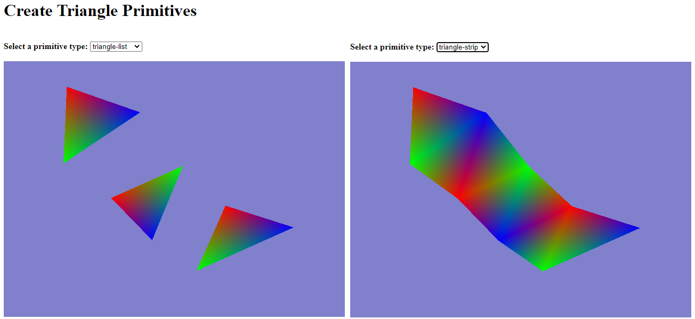

# Step-by-Step WebGPU Graphics Programming (6) 
## WebGPU Primitives: Points and Lines

This is the source code for the 6th part of a series YouTube videos on step-by-step WebGPU graphics programming.

This sample WebGPU app shows how to create triangle primitives. The output from the app is shown in the following image.

